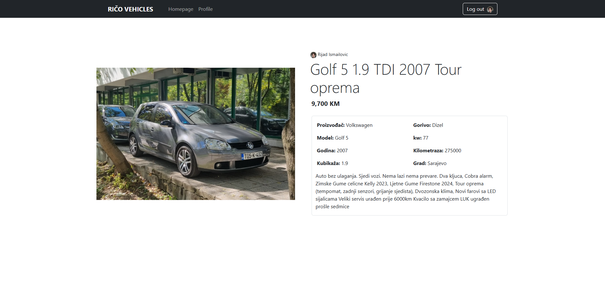
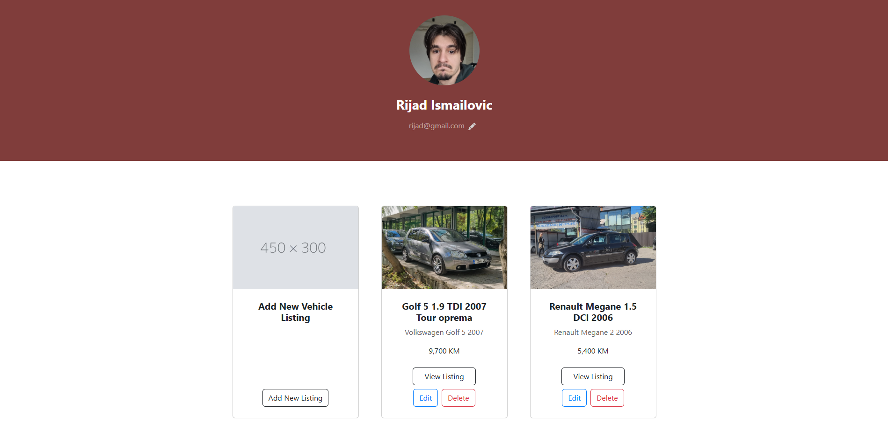
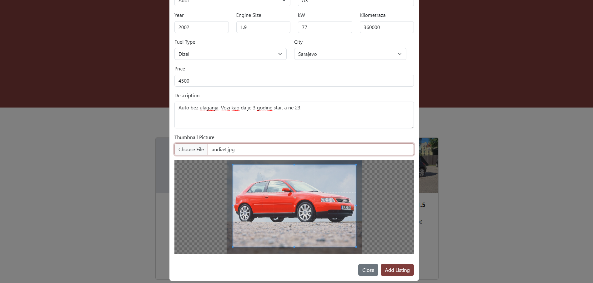

# Car marketplace

A fullstack website inspired by [OLX.ba](https://www.olx.ba). 
I used this project to learn Springboot and Vite.js

## Technologies used

- **Backend**: SpringBoot, MySQL
- **Frontend**: React (Powered by Vite.js), JavaScript

## Features

- **User Management**: CRUD for users.
- **Vehicle Listings**: CRUD for vehicle listings.
- **Database**: MySQL for storing users and vehicles.
- **Modern Frontend**: Built with Vite.js for a fast and responsive user experience.

